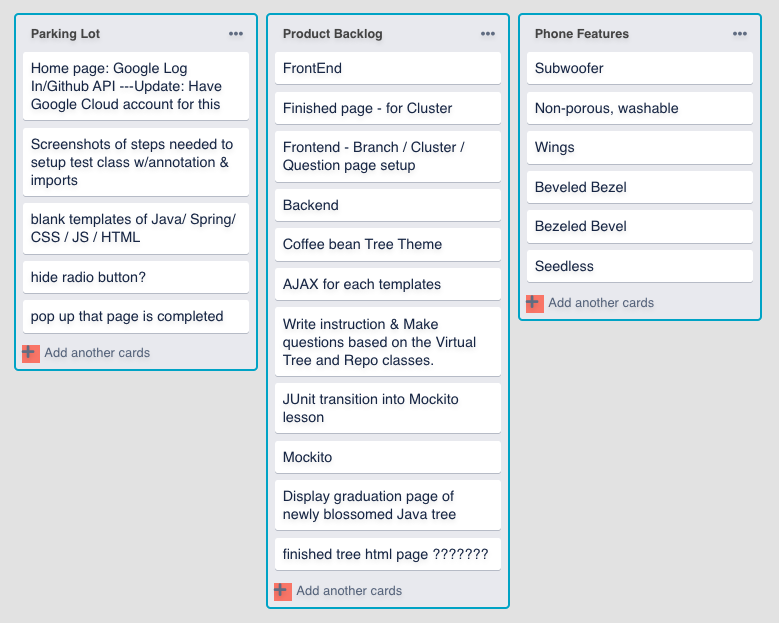
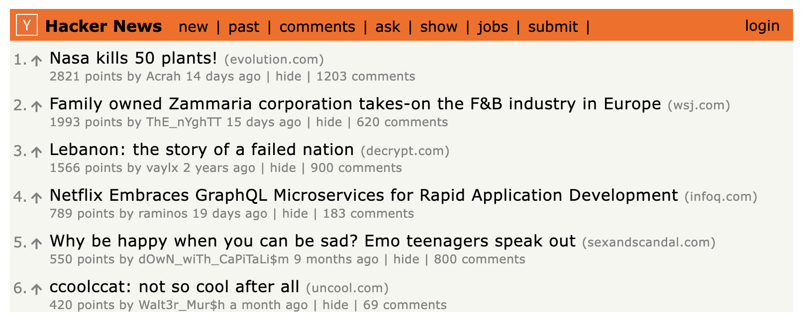
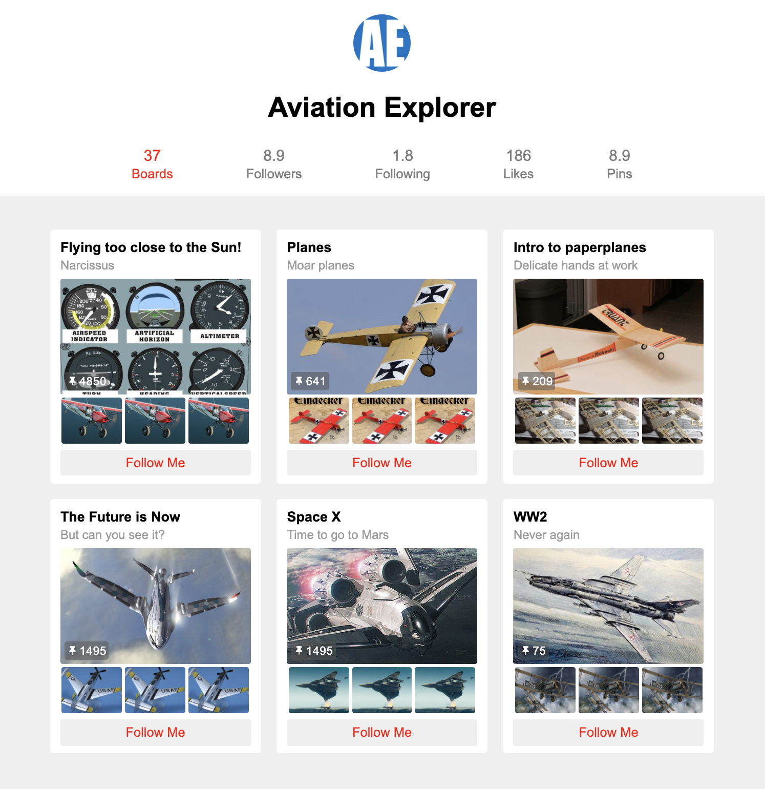
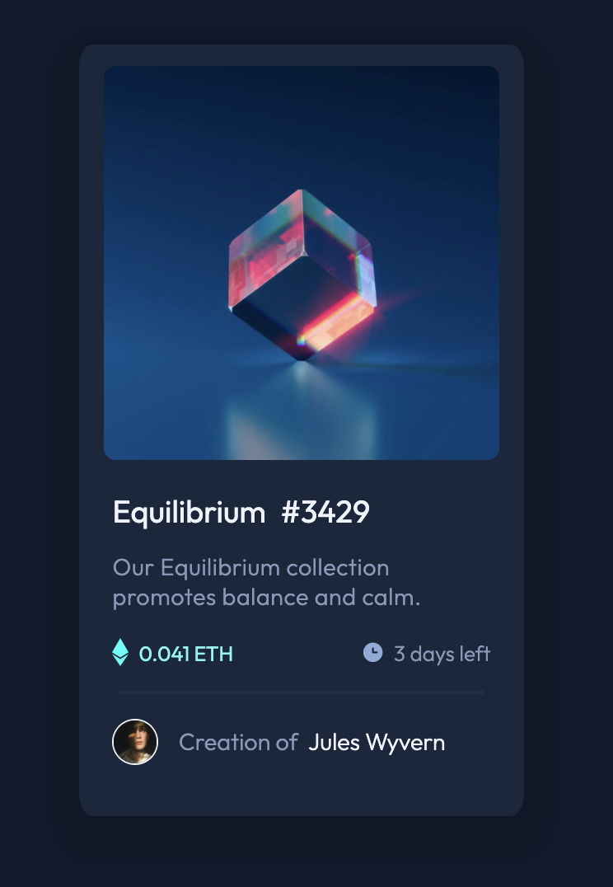
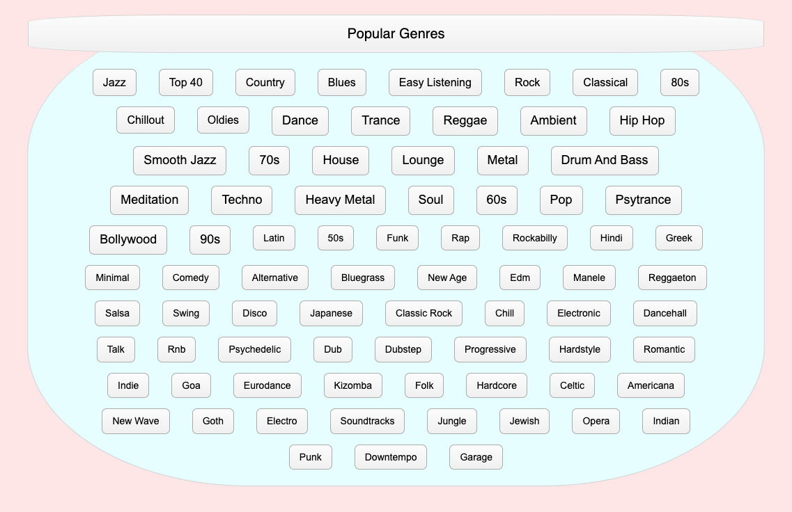

# Exercises

## 1. trello-copy-exercise

- Work on rendering a single list of cards. For more practice, render multiple lists of cards side-by-side.
- 

## 2. hacker-news-exercise

- Implement the list of stories. For more practice, implement the header too.
- 

## 3. pinterest-exercise

- Implement a list of image cards. For more practice, implement the header too.
- 

## 4. nft-preview-card (bonus challenge)

- Implement an NFT preview card component
- 

## 5. internet-radio-exercise

- Come up with a nice way of sizing the buttons so they get progressively larger.
- 
